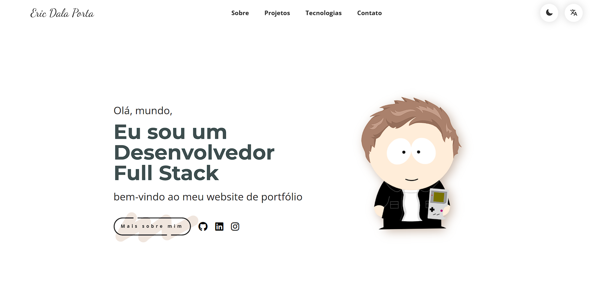

# Meu Portfólio com temática de South Park 📜

Bem-vindo ao repositório do meu portfólio pessoal! É um projeto simples, mas visualmente criativo e com muita personalidade.

**[Acessar a versão ao vivo 💻](https://ericdalaporta.github.io/portfolio/)**

 

---

## Funcionalidades ✨

Este projeto foi construído com diversas funcionalidades interativas para proporcionar uma ótima experiência ao usuário:

* **Design Interativo:** Componentes com micro-interações e um visual limpo e moderno.
* **Dark Mode:** Alternância entre tema claro e escuro com transição suave.
* **Multi-idioma:** Suporte completo para Português (PT-BR) e Inglês (EN), com a preferência salva no navegador do usuário.
* **Animações Dinâmicas:** Animações de entrada para as seções conforme o scroll, utilizando a biblioteca **GSAP (ScrollTrigger)** para um efeito fluido.
* **Cards de Projeto com Efeito "Flip":** Cards que, ao passar o mouse, revelam o título, uma descrição detalhada e botões para a demonstração e o código.
* **Componentes Personalizados:** Botões de controle e de ação com design e animações únicos.

---

## Tecnologias Utilizadas 🛠️

O projeto foi construído utilizando as tecnologias mais modernas para desenvolvimento front-end:


---

## Como Executar Localmente 📂

Como este é um projeto estático, não há necessidade de instalação de dependências.

1.  **Clone o repositório:**
    ```bash
    git clone [https://github.com/ericdalaporta/portfolio.git](https://github.com/ericdalaporta/portfolio.git)
    ```
2.  **Navegue até a pasta do projeto:**
    ```bash
    cd portfolio
    ```
3.  **Abra o arquivo `index.html`** no seu navegador de preferência.

---

## Comandos Git para Deploy (Git Bash) 🚀

Estes são os comandos que utilizei para inicializar o repositório e fazer o deploy no GitHub Pages.

1.  **Crie um novo repositório** no GitHub chamado `portfolio`.
2.  **Abra o Git Bash** na pasta local do seu projeto e execute os seguintes comandos:

    ```bash
    # Inicializa o repositório local
    git init

    # Adiciona todos os arquivos para o stage
    git add .

    # Faz o primeiro commit
    git commit -m "Primeiro commit: Versão inicial do portfólio"

    # Renomeia a branch principal para "main"
    git branch -M main

    # Adiciona o link do repositório remoto
    git remote add origin [https://github.com/ericdalaporta/portfolio.git](https://github.com/ericdalaporta/portfolio.git)

    # Envia os arquivos para o GitHub
    git push -u origin main
    ```

Após o `push`, vá nas configurações do seu repositório no GitHub, na seção "Pages", e configure a fonte de deploy para a branch `main`. Em alguns minutos, seu site estará no ar!

---

## Contato 📬

Vamos criar algo incrível juntos! Entre em contato pelo meu email: ericdasilvadalaporta@gmail.com
