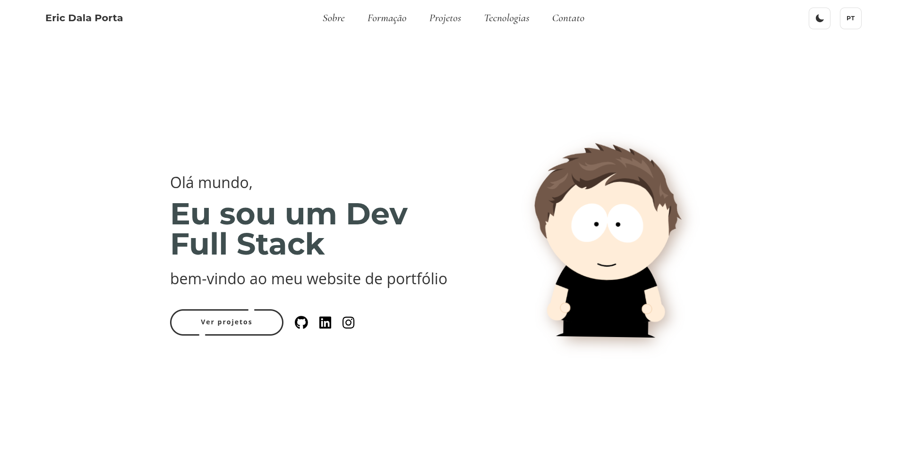

# Portfólio com tema South Park

Site de portfólio pessoal desenvolvido com HTML, CSS e JavaScript puro. Disponível em **[ericdalaporta.github.io/portfolio](https://ericdalaporta.github.io/portfolio/)**.



## Funcionalidades

- **Tema claro/escuro** com preferência persistida via `localStorage`
- **Internacionalização (PT-BR / EN)** com troca dinâmica de conteúdo sem recarregar a página
- **Animações de scroll** com GSAP ScrollTrigger
- **Menu mobile** como dropdown flutuante com glassmorphism
- **Layout totalmente responsivo**

## Stack


Sem frameworks, sem dependências de build. Apenas arquivos estáticos.


## Executar localmente

```bash
git clone https://github.com/ericdalaporta/portfolio.git
cd portfolio
```

Abra `index.html` diretamente no navegador ou use uma extensão como Live Server no VS Code.


## Contato

[ericdasilvadalaporta@gmail.com](mailto:ericdasilvadalaporta@gmail.com) · [LinkedIn](https://linkedin.com/in/ericdalaporta) · [GitHub](https://github.com/ericdalaporta)
